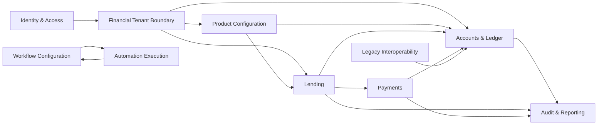

# Mapa de contextos do MAVULA

Estado: **Accepted**

Decisão: 2026-06-27

RFC: [RFC-0001](https://github.com/orgs/mavulahq/discussions/1)

Este documento define as fronteiras de negócio iniciais do MAVULA. As fronteiras são orientadas por linguagem, invariantes e ownership de dados; não reproduzem simplesmente a estrutura atual de pastas.

## Regras de fronteira

- Cada agregado possui um único contexto responsável por alterar o seu estado.
- Outros contextos integram por API, comando ou evento e nunca escrevem diretamente nas tabelas do owner.
- Uma operação financeira aplica autorização, tenant e invariantes no lado de comando, dentro da transação adequada.
- Eventos públicos expõem factos de negócio estáveis, não modelos internos nem dados pessoais desnecessários.
- Jobs descrevem trabalho a executar; eventos de domínio descrevem factos que já aconteceram.

## Contextos

| Contexto                  | Owner               | Dados e agregados controlados                                                      | Estado atual                                                                                |
| ------------------------- | ------------------- | ---------------------------------------------------------------------------------- | ------------------------------------------------------------------------------------------- |
| Identity & Access         | `identity-access`   | instituições, filiais, operadores, credenciais, sessões, roles e políticas         | Fundação OIDC implementada; APIs administrativas de lifecycle permanecem pendentes           |
| Financial Tenant Boundary | `ledger-core`       | referência local de tenant, partição financeira e contexto necessário para RLS     | Binding institucional, RLS transacional e testes cross-tenant implementados                   |
| Product Configuration     | `ledger-core`       | produtos, regras, taxas, limites, schemas e versões publicadas                     | Produtos, regras e schemas existem; publicação e versionamento imutável são lacunas         |
| Accounts & Ledger         | `ledger-core`       | contas, transações financeiras, plano de contas e journal entries                  | Lifecycle e subledger de contas implementados; reversões e correções públicas permanecem pendentes |
| Lending                   | `ledger-core`       | empréstimos, decisões, desembolsos, calendários e reembolsos                       | Lifecycle principal implementado                                                            |
| Payments                  | `settlements`       | instruções, callbacks de providers, liquidação, reconciliação e reversões externas | Contratos de adapter existem; integrações de providers e reconciliação permanecem planeadas |
| Workflow Configuration    | `ledger-core`       | definições de workflow, triggers, schemas e políticas de execução                  | Definição e execução básica existem no `ledger-core`                                        |
| Automation Execution      | `workbench`         | jobs, schedules, tentativas, dead-letter queues e receipts de execução             | BullMQ, retries, schedules, métricas e callbacks implementados                              |
| Audit & Reporting         | `ledger-core`       | trilho de auditoria canônico e factos necessários para projeções e relatórios      | Audit trail existe; read models e reporting dedicados são planeados                         |
| Legacy Interoperability   | `legacy-connectors` | copybooks, layouts fixed-width, batches e traduções para sistemas legados          | Planeado pela RFC-0002 após estabilização dos contratos públicos                            |

`operations` é uma capacidade de plataforma que provisiona e opera PostgreSQL, Redis, Kubernetes, observabilidade e secrets. `developer-docs` publica contratos e documentação técnica. Nenhum deles é um bounded context de negócio nem possui agregados financeiros.

## Relações

As setas representam integração por contrato, não permissão de escrita direta.

## Fronteiras transitórias

- `ledger-core` continua a validar tokens e a aplicar tenant/RBAC como resource server, mas deixa de emitir credenciais ou atribuir roles quando `identity-access` estiver ativo.
- A referência local de tenant em `ledger-core` existe para integridade financeira e RLS; não transfere ownership de instituições, filiais ou operadores.
- `ledger-core` continua a coordenar transações de desembolso e pagamento até `settlements` possuir o seu modelo e adapters. A extração não pode transferir ownership do ledger.
- `ledger-core` possui definições de workflow; `workbench` possui apenas o estado operacional de jobs. Um job BullMQ não é um evento de domínio.
- `legacy-connectors` integra exclusivamente por contratos aprovados e nunca escreve diretamente nos stores dos contextos owner.
- O audit trail registra ações atuais. A Fase 2 introduz vertical slices de domain events para `products.configuration_published`, `ledger.journal_posted`, `lending.loan_disbursed` e `lending.payment_posted`; os demais eventos continuam propostos até terem implementação equivalente.
